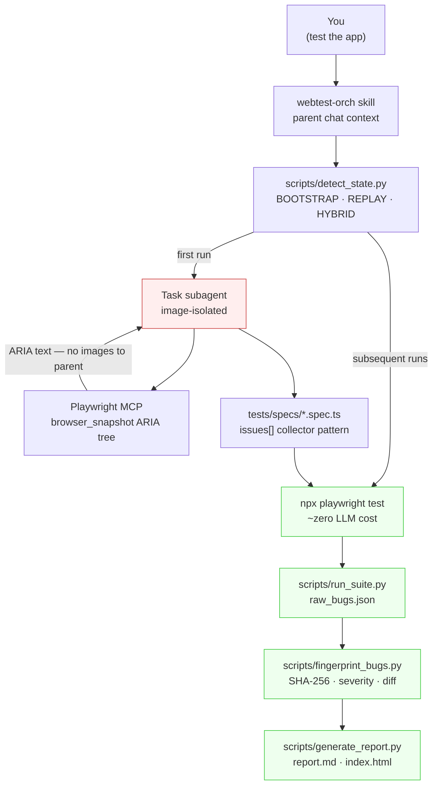

# webtest-orch

[](https://github.com/CreatmanCEO/webtest-orch/actions/workflows/ci.yml)
[](LICENSE)
[](https://www.npmjs.com/package/webtest-orch)
[](https://www.python.org/downloads/)
[](https://nodejs.org)
[](https://code.claude.com)

🇬🇧 English · [🇷🇺 Русский](README.ru.md)

**A Claude Code skill that automates end-to-end testing for any web app — and respects Claude's invisible inline-image budget so your `/compact` doesn't fire on screenshot 51.**

> First run: LLM-driven exploration via Playwright MCP, ARIA-tree-first, generates `*.spec.ts`. Subsequent runs: deterministic `npx playwright test`, ~zero LLM tokens. Bug fingerprinting diffs runs (new / regression / persisting / fixed). Linear / GitHub / Jira tracker mappings out of the box.

---

## Why this exists

Claude Code has **two independent context limits**: text tokens (large) and inline-image blocks (~50–100 per session). The image budget is invisible — you don't see a counter, you just hit a wall and have to `/compact` even when text-context is at 20%. Standalone Playwright MCP burns through it in under an hour because every screenshot returned to the parent context is one image-budget block.

**This skill makes the image-budget cost zero.** All browser work runs inside Task subagents; the parent chat receives only text — paths, descriptions, verdicts. Pixel-diff regression returns `pass/fail + diff%` as plain text. Vision classification of a single failed screenshot is delegated to one nested subagent that reads the image inside its own context and returns one line.

The other half of the skill is the orchestration layer over the 2026 LLM-driven testing stack — Playwright MCP for exploration, Playwright CLI for replay, axe-core for the deterministic 57% of WCAG, and a deterministic console-noise classifier so the LLM is only invoked on messages that aren't already in a pattern table.

> Validated end-to-end on two production apps: a static Next.js portfolio (4 real bugs found, 0 false positives) and a Supabase + FastAPI + WebSocket SaaS chat (10/10 generated specs ran green after 4 iterations, ~12 min wall-clock).

---

## How it works — three phases, one budget invariant



| Phase | What happens | Image budget cost |
|---|---|---|
| **State probe** | `detect_state.py` reads `tests/`, `playwright.config.ts`, `.env.test`, listening ports → JSON → mode hint (BOOTSTRAP / REPLAY / HYBRID) | 0 |
| **BOOTSTRAP exploratory** (first run) | Task subagent uses Playwright MCP `browser_snapshot` (ARIA tree, text). Walks login / chat / settings / logout. Generates POMs + `tests/specs/*.spec.ts`. | 0 in parent (subagent isolated) |
| **REPLAY** (subsequent runs) | `npx playwright test` directly. Console listeners, axe-core, `toHaveScreenshot` — all run in spec, return text. | 0 |
| **Vision classification** (only when `toHaveScreenshot` fires) | Nested Task subagent reads ONE image, returns `<verdict>: <reason>` line | 0 in parent, 1 per subagent (max 3-5/run) |
| **Fingerprint + diff** | Composite SHA-256 of `(selector \| assertion \| error class \| URL template \| message)`. Diff state: `new` / `regression` / `persisting` / `fixed`. | 0 |
| **Report** | `report.md` + self-contained `index.html` + `bugs.json` with Linear / GitHub / Jira mappings | 0 |

The image-budget invariant is non-negotiable. Any code path that returns a screenshot inline to the parent chat is a bug.

---

## What you actually get

```
~/.claude/skills/webtest-orch/
├── SKILL.md                            # workflow for Claude Code (~250 lines)
├── README.md, CHANGELOG.md, LICENSE    # human-facing docs
├── install.sh                          # bash installer (alternative to npm)
├── bin/webtest-orch.js                 # CLI: install / status / uninstall
├── scripts/
│   ├── detect_state.py                 # JSON state probe + mode hint
│   ├── with_server.py                  # dev-server lifecycle (front + back)
│   ├── run_suite.py                    # wraps `playwright test`, normalizes JSON,
│   │                                   #  splits issues[] collector into per-issue bug records
│   ├── fingerprint_bugs.py             # SHA-256 fingerprints, severity heuristics,
│   │                                   #  Linear/GitHub/Jira tracker mappings, run diff
│   ├── triage_console.py               # default ignore-list for GTM/Stripe/Pydantic/
│   │                                   #  Next.js Turbopack/Supabase realtime/etc.
│   ├── visual_diff.py                  # locates toHaveScreenshot failures,
│   │                                   #  prepares vision-classification tasks
│   ├── vision_classify.py              # validates `<verdict>: <reason>` from subagent
│   ├── generate_report.py              # report.md + self-contained index.html + diff
│   ├── preflight.py                    # base-URL HEAD check + auth env validation
│   └── _image_isolation_check.py       # self-test for the budget invariant
├── reference/                          # loaded on-demand, not at activation
│   ├── playwright-patterns.md          # locator priority, anti-flake, tabs-vs-buttons
│   ├── auth-strategies.md              # Supabase · custom JWT · UI fallback · onboarding flags
│   ├── a11y-patterns.md                # axe + qualitative review via nested subagent
│   ├── responsive-checklist.md         # viewports, touch targets, overflow detection
│   ├── console-noise-patterns.md       # ignore-list patterns + bug-classifier table
│   ├── stack-specific.md               # Next.js · FastAPI · Telegram WebApp · WS/SSE · TTS
│   └── reporting.md                    # bugs.json schema · severity mapping · tracker integrations
├── templates/
│   ├── playwright.config.ts.tmpl       # with auth (setup project + storageState)
│   ├── playwright.config.public.ts.tmpl # no-auth variant
│   ├── auth.setup.ts.tmpl              # Supabase → custom JWT → UI fallback chain
│   ├── fixture.ts.tmpl, pom.ts.tmpl    # POM + fixture skeletons
│   └── spec.ts.tmpl                    # canonical issues[] collector pattern
└── examples/
    ├── public-landing.spec.ts          # static site (no auth)
    ├── authed-dashboard.spec.ts        # POM + storageState
    └── telegram-webapp.spec.ts         # mocked window.Telegram.WebApp
```

---

## Quick Start (3 minutes)

### 1. Install the skill

```bash
npx webtest-orch@beta install
```

This copies the skill into `~/.claude/skills/webtest-orch/` and checks for the required MCP servers.

### 2. Add the MCP servers (if the installer reports them missing)

```bash
claude mcp add --scope user playwright npx @playwright/mcp@latest
claude mcp add --scope user chrome-devtools npx chrome-devtools-mcp@latest
```

### 3. Restart Claude Code

Skills are loaded at session start.

### 4. Add `.env.test` to your project

For an authenticated SaaS (Supabase example):

```bash
TEST_BASE_URL=https://your-app.example.com
TEST_USER_EMAIL=qa@example.com
TEST_USER_PASSWORD=...
SUPABASE_URL=https://abcdefgh.supabase.co
SUPABASE_ANON_KEY=eyJhbGc...
```

For a public site:

```bash
TEST_BASE_URL=https://your-public-site.example.com
```

### 5. In Claude Code

Just say:

> test the app

or run the slash command `/test-app`. Skill auto-detects authed vs public, scaffolds Playwright + axe-core, runs the first exploratory pass, and writes `reports/<run-id>/index.html` you can open in a browser.

For more triggering keywords (`smoke test`, `regression run`, `audit accessibility`, etc.), see [SKILL.md](SKILL.md).

---

## What gets tested out of the box

Every generated spec runs through the **issues[] collector pattern** — all soft checks accumulate, the test fails once at the end with the full picture instead of stopping at the first miss:

- **Console errors** — listeners attached BEFORE `page.goto()`. Default ignore-list covers GTM, Stripe deprecations, Sentry self-warnings, Pydantic FastAPI warnings, Next.js 15 Turbopack signals, Supabase realtime debug, ResizeObserver loop, AbortError on unmount, browser-extension noise, and 9 more patterns. Hydration mismatches, uncaught TypeErrors, CORS / CSP violations, 5xx / 4xx responses are reported with severity.
- **WCAG 2.2 AA via axe-core** — every spec runs `AxeBuilder` and pushes each violation as `a11y[impact] rule-id: help (Nx nodes)` into `issues[]`. Severity inferred from axe impact level.
- **Heading hierarchy** — no `h1 → h3` jumps. Detects the common Tailwind/headlessui pattern of project lists.
- **Touch targets (WCAG 2.5.8)** — every interactive element ≥ 24×24 CSS px. Mobile project (`chromium-mobile`, 390×844) catches what desktop misses.
- **Horizontal overflow** — `scrollWidth > clientWidth` per viewport.
- **`html lang` attribute** — present.

Visual regression uses Playwright's `toHaveScreenshot()` (zero external dependencies). When pixel-diff fires, `visual_diff.py` queues a vision-classification task and a Task subagent (one image, returns text) labels it `noise` / `redesign` / `bug-S0..3`.

---

## Severity model

| Severity | When the skill assigns it |
|---|---|
| **S0 Critical** | Auth broken, payment fails, 5xx on main routes, uncaught JS errors, hydration mismatch on critical flow |
| **S1 Major** | Form non-functional, primary nav broken, CORS / CSP violation, axe `serious` / `critical`, horizontal overflow |
| **S2 Moderate** | Validation message wrong, secondary feature degraded, axe `moderate`, heading jump, touch-target < 24×24, html-lang missing |
| **S3 Minor** | Visual / pixel diff, alignment shifts, axe `minor`, title check failure |

Override the heuristic per-spec using **three mechanisms** (priority order):

1. Inline tag in collector: `issues.push('[severity:S0] payment completely broken')`
2. Inline tag in test name: `test('[severity:S0] checkout fails', ...)`
3. Comment before the test: `// @severity: S0\n  test('...', ...)` → parsed by `fingerprint_bugs.py`

This solves the false-negative case where a P0 product regression scores S2 by heuristic and the report says ✅ SHIP-READY.

---

## CLI commands

```bash
npx webtest-orch help              # all commands
npx webtest-orch status            # is the skill installed? are MCPs present?
npx webtest-orch install           # copy mode (default; production-safe)
npx webtest-orch install --symlink # symlink mode (development; needs admin on Windows)
npx webtest-orch uninstall         # removes the skill, leaves the npm package
npx webtest-orch version
```

---

## Documentation

- **[SKILL.md](SKILL.md)** — workflow Claude follows when activated, with the canonical spec generation contract.
- **[CHANGELOG.md](CHANGELOG.md)** — versioned per release; current beta is `0.3.0`.
- **[reference/auth-strategies.md](reference/auth-strategies.md)** — Supabase / custom JWT / UI fallback / onboarding flags.
- **[reference/stack-specific.md](reference/stack-specific.md)** — Next.js, FastAPI, Telegram WebApp, WebSocket DOM-fallback strategy, TTS canvas patterns.
- **[reference/reporting.md](reference/reporting.md)** — bugs.json schema, severity mapping, Linear / GitHub / Jira CLI examples.
- **[CONTRIBUTING.md](CONTRIBUTING.md)** — PR workflow.

---

## Status — public beta

**`0.3.0-beta`** — image-budget protection, Supabase auth, severity annotations, full CI on Linux/macOS/Windows, 113 tests. Validated end-to-end on two production apps. Looking for early users to find the rough edges — see the **[OS-compatibility report](.github/ISSUE_TEMPLATE/os-compatibility-report.md)** issue template if you ran the install on a non-Windows OS.

What's next:
- `0.4.0` — vision-classifier auto-loop, console LLM auto-triage, Lighthouse audit script, tracker auto-filing CLI, regression watchlist, layout integrity assertions.

---

## License

MIT — see [LICENSE](LICENSE).

## Contributing

PRs welcome — see [CONTRIBUTING.md](CONTRIBUTING.md). For OS-specific bug reports use the dedicated [issue template](.github/ISSUE_TEMPLATE/os-compatibility-report.md).
