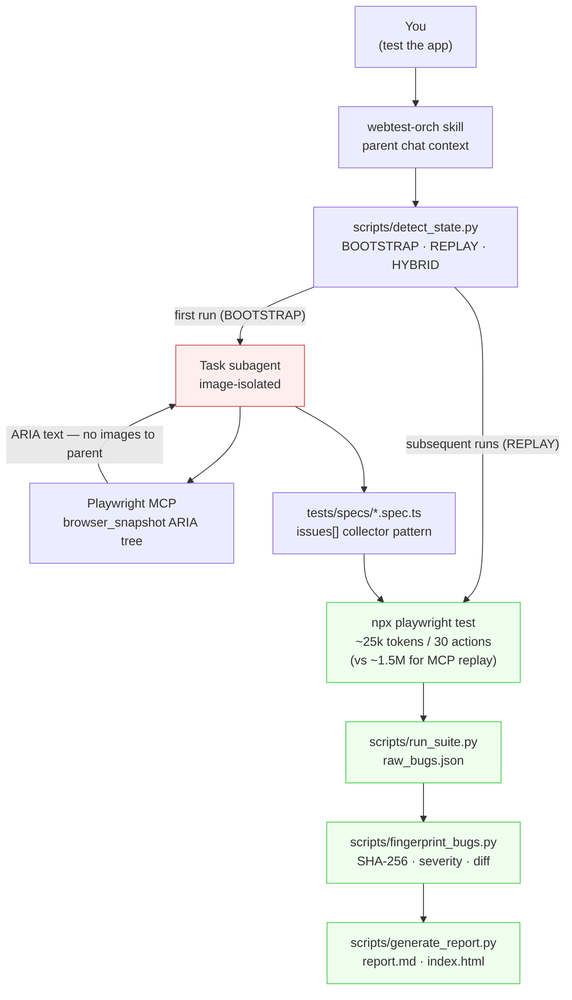

# webtest-orch

[](https://github.com/CreatmanCEO/webtest-orch/actions/workflows/ci.yml)
[](LICENSE)
[](https://www.npmjs.com/package/webtest-orch)
[](https://www.python.org/downloads/)
[](https://nodejs.org)
[](https://code.claude.com)

🇬🇧 English · [🇷🇺 Русский](README.ru.md)

**Token-efficient e2e orchestration skill for Claude Code. Explore once with Playwright MCP — ARIA snapshots, not images. Replay deterministically with `npx playwright test` — ~zero LLM tokens. Bug fingerprinting + run-diff (new / regression / persisting / fixed) out of the box. Tests live in your repo as plain `*.spec.ts`. MIT.**

> **Why this exists, in one number:** Playwright MCP burns ~**1.5M tokens** verifying an e-commerce checkout. Playwright **CLI** does the same in ~**25–27k** ([Özal benchmark](https://github.com/microsoft/playwright-mcp/issues/889), [TestDino](https://testdino.com/blog/playwright-cli/), [Morph](https://scrolltest.medium.com/playwright-mcp-burns-114k-tokens-per-test-the-new-cli-uses-27k-heres-when-to-use-each-65dabeaac7a0)). The fix isn't "use less Playwright MCP" — it's split **exploration** (LLM-driven, generates spec.ts) from **replay** (deterministic, runs forever). webtest-orch is the orchestration layer that does both.

---

## Where this fits

The 2026 AI-testing market splits into two bands:

| Band | Examples | Pricing | What you pay for |
|---|---|---|---|
| **Paid SaaS** | [Octomind](https://octomind.dev) ($89–$589/mo, [now winding down](https://octomind.dev/blog/a-letter-to-our-users-customers-and-readers/)), [QA Wolf](https://www.qawolf.com) (~$8k/mo entry, $60–250k/yr typical), [Mabl](https://mabl.com), [BrowserStack AI](https://www.browserstack.com/low-code-automation/ai-agents) | Cloud parallelism, human triage layer, SOC 2, SLAs, dashboards | $1k–$25k/mo realistic spend |
| **Free / OSS** | [`playwright init-agents --loop=claude`](https://playwright.dev/docs/test-agents), [Magnitude](https://github.com/magnitudedev/magnitude), **webtest-orch** | Skill / SDK / CLI you run yourself; tests live in your repo | $0/mo — but no managed cloud, no human review, no SOC 2 |

**webtest-orch's honest peer group is the free tier.** The defensible deltas vs Microsoft's native Test Agents and Magnitude are: out-of-the-box `axe-core` a11y, console + network audit, **bug fingerprinting with run-diff**, and Linear / GitHub / Jira tracker mappings — none of which the free alternatives ship.

**For solo devs, indie hackers, and 1–10 engineer startups already on Claude Code with no QA budget**, webtest-orch is a credible drop-in replacement for paid AI testing tools. For teams with budget for cloud parallelism + human review at scale, it isn't — and we don't pretend otherwise.

---

## What we deliberately do NOT ship

- **No self-healing.** The QA community in 2026 has [pushed back on self-healing as marketing spin](https://bugbug.io/blog/test-automation/self-healing-test-automation/) — the failure mode is well-documented: healer picks visually-similar-but-wrong element, test goes green, bug ships. Engineers stop trusting suites that *lie*. We prefer red over false-green. *If you want native Playwright Healer, it's free via `npx playwright init-agents --loop=claude` and our generated specs are compatible — see [reference/playwright-patterns.md](reference/playwright-patterns.md) for the recommended skip-real-bugs policy.*
- **No vendor cloud.** Tests stay in your repo. Reports stay on your filesystem. If our package disappears tomorrow, your suite still runs.
- **No "AI writes all your tests" pitch.** webtest-orch is a *complement*, not a replacement, for engineering judgment. It's especially good at the boring 80%: a11y, console, network, responsive, regression diffs.

---

## How it works — three phases, one budget invariant



| Phase | What happens | Token cost |
|---|---|---|
| **State probe** | `detect_state.py` reads `tests/`, `playwright.config.ts`, `.env.test`, listening ports → JSON → mode hint (BOOTSTRAP / REPLAY / HYBRID) | 0 |
| **BOOTSTRAP exploratory** (first run) | Task subagent uses Playwright MCP `browser_snapshot` (ARIA tree, text). Walks login / chat / settings / logout. Generates POMs + `tests/specs/*.spec.ts`. | ~500k tokens for full app exploration; image budget cost = 0 in parent (subagent isolated) |
| **REPLAY** (every subsequent run) | `npx playwright test` directly. Console listeners, axe-core, `toHaveScreenshot()` — all run in spec, return text. | **~25–27k tokens / 30 actions** ([TestDino](https://testdino.com/blog/playwright-cli/) / [Morph](https://scrolltest.medium.com/playwright-mcp-burns-114k-tokens-per-test-the-new-cli-uses-27k-heres-when-to-use-each-65dabeaac7a0)) — 50–60× cheaper than Playwright MCP replay |
| **Vision classification** (only when `toHaveScreenshot` fires) | Nested Task subagent reads ONE image, returns `<verdict>: <reason>` line | 0 in parent, 1 image per subagent (max 3-5 / run) |
| **Fingerprint + diff** | Composite SHA-256 of `(selector \| assertion \| error class \| URL template \| message)`. Diff state: `new` / `regression` / `persisting` / `fixed` | 0 |
| **Report** | `report.md` + self-contained `index.html` + `bugs.json` with Linear / GitHub / Jira mappings | 0 |

The image-budget invariant is the architectural anchor: **the parent chat never receives an image, ever**. All browser work runs inside Task subagents; the parent receives only text. Verified empirically — a subagent reads N PNGs, returns N text lines, parent's image counter doesn't increment.

---

## Built on real benchmarks

This isn't a vibe-coded testing skill. The architecture comes from verified 2026 numbers:

| Claim | Source | Implication |
|---|---|---|
| Playwright MCP: ~**1.5M** tokens / e-commerce verify | [Özal benchmark](https://github.com/microsoft/playwright-mcp/issues/889) | Don't use MCP for replay |
| Playwright CLI: ~**25–27k** tokens / 30 actions | [TestDino](https://testdino.com/blog/playwright-cli/), [Morph](https://scrolltest.medium.com/playwright-mcp-burns-114k-tokens-per-test-the-new-cli-uses-27k-heres-when-to-use-each-65dabeaac7a0) | Use CLI for replay — 50–60× cheaper |
| 4-agent pipeline (Plan → Generate → Run → Heal): **~4×** less tokens vs live-MCP | [TestDino blog](https://testdino.com/blog) | Validate webtest-orch architecture choice |
| **a11y-tree primary + selective vision** beats vision-first on cost AND reliability | Microsoft Fara-7B, [arXiv 2511.19477](https://arxiv.org/abs/2511.19477), Browserbase evals | ARIA `browser_snapshot` is correct default, not screenshots |
| **axe-core** auto-detects ~**57%** of real WCAG issues | [Deque 13,000-page study](https://www.deque.com/) | The other 43% requires LLM judgment — skill ships both |
| Microsoft README now recommends **CLI + Skills over MCP** for coding agents | [Microsoft Playwright official docs](https://playwright.dev/docs/test-agents) | We're aligned with vendor's own architectural recommendation |
| WCAG 2.5.8 AA touch-target = **24×24 CSS px** | [W3C](https://www.w3.org/WAI/WCAG22/Understanding/target-size-minimum.html) | Hard rule, mobile project enforces |
| ADA Title II compliance deadline: **April 24, 2026** for state/local govt (WCAG 2.1 AA) | [W3C / DOJ](https://www.ada.gov/resources/2024-03-08-web-rule/) | Legal context for a11y findings |

---

## What you actually get

```
~/.claude/skills/webtest-orch/
├── SKILL.md                            # workflow for Claude Code (~250 lines)
├── README.md, CHANGELOG.md, LICENSE    # human-facing docs
├── install.sh                          # bash installer (alternative to npm)
├── bin/webtest-orch.js                 # CLI: install / status / uninstall
├── scripts/
│   ├── detect_state.py                 # JSON state probe + mode hint
│   ├── with_server.py                  # dev-server lifecycle (front + back)
│   ├── run_suite.py                    # wraps `playwright test`, normalizes JSON,
│   │                                   #  splits issues[] collector into per-issue bug records
│   ├── fingerprint_bugs.py             # SHA-256 fingerprints, severity heuristics,
│   │                                   #  Linear/GitHub/Jira tracker mappings, run diff
│   ├── triage_console.py               # default ignore-list for GTM/Stripe/Pydantic/
│   │                                   #  Next.js Turbopack/Supabase realtime/etc.
│   ├── visual_diff.py                  # locates toHaveScreenshot failures,
│   │                                   #  prepares vision-classification tasks
│   ├── vision_classify.py              # validates `<verdict>: <reason>` from subagent
│   ├── generate_report.py              # report.md + self-contained index.html + diff
│   ├── preflight.py                    # base-URL HEAD check + auth env validation
│   └── _image_isolation_check.py       # self-test for the budget invariant
├── reference/                          # loaded on-demand, not at activation
│   ├── playwright-patterns.md          # locator priority, anti-flake, tabs-vs-buttons,
│   │                                   #  no-self-heal-by-design rationale
│   ├── auth-strategies.md              # Supabase · custom JWT · UI fallback · onboarding flags
│   ├── a11y-patterns.md                # axe + qualitative review via nested subagent
│   ├── responsive-checklist.md         # viewports, touch targets, overflow detection
│   ├── console-noise-patterns.md       # ignore-list patterns + bug-classifier table
│   ├── stack-specific.md               # Next.js · FastAPI · Telegram WebApp · WS/SSE · TTS
│   └── reporting.md                    # bugs.json schema · severity mapping · tracker integrations
├── templates/
│   ├── playwright.config.ts.tmpl       # with auth (setup project + storageState)
│   ├── playwright.config.public.ts.tmpl # no-auth variant
│   ├── auth.setup.ts.tmpl              # Supabase → custom JWT → UI fallback chain
│   ├── fixture.ts.tmpl, pom.ts.tmpl    # POM + fixture skeletons
│   └── spec.ts.tmpl                    # canonical issues[] collector pattern
└── examples/
    ├── public-landing.spec.ts          # static site (no auth)
    ├── authed-dashboard.spec.ts        # POM + storageState
    └── telegram-webapp.spec.ts         # mocked window.Telegram.WebApp
```

---

## Quick Start (3 minutes)

### 1. Install the skill

```bash
npx webtest-orch@beta install
```

This copies the skill into `~/.claude/skills/webtest-orch/` and checks for the required MCP servers.

### 2. Add the MCP servers (if the installer reports them missing)

```bash
claude mcp add --scope user playwright npx @playwright/mcp@latest
claude mcp add --scope user chrome-devtools npx chrome-devtools-mcp@latest
```

### 3. Restart Claude Code

Skills are loaded at session start.

### 4. Add `.env.test` to your project

For an authenticated SaaS (Supabase example):

```bash
TEST_BASE_URL=https://your-app.example.com
TEST_USER_EMAIL=qa@example.com
TEST_USER_PASSWORD=...
SUPABASE_URL=https://abcdefgh.supabase.co
SUPABASE_ANON_KEY=eyJhbGc...
```

For a public site:

```bash
TEST_BASE_URL=https://your-public-site.example.com
```

### 5. In Claude Code

Just say:

> test the app

or run the slash command `/test-app`. Skill auto-detects authed vs public, scaffolds Playwright + axe-core, runs the first exploratory pass, and writes `reports/<run-id>/index.html` you can open in a browser.

---

## What gets tested out of the box

Every generated spec follows the **issues[] collector pattern** — soft checks accumulate, the test fails once at the end with the full picture instead of stopping at the first miss:

- **Console errors** — listeners attached BEFORE `page.goto()`. Default ignore-list covers GTM, Stripe deprecations, Sentry self-warnings, Pydantic FastAPI warnings, Next.js 15 Turbopack signals, Supabase realtime debug, ResizeObserver loop, AbortError on unmount, browser-extension noise, and 9 more patterns. Hydration mismatches, uncaught TypeErrors, CORS / CSP violations, 5xx / 4xx responses → bug records with severity.
- **WCAG 2.2 AA via axe-core** — `AxeBuilder.withTags(['wcag2a','wcag2aa','wcag21aa','wcag22aa']).analyze()`. Each violation pushed as `a11y[impact] rule-id: help (Nx nodes)` into `issues[]`. Severity inferred from axe `impact` (critical/serious → S1, moderate → S2, minor → S3).
- **Heading hierarchy** — no `h1 → h3` jumps. Catches the common Tailwind/headlessui pattern of project lists.
- **Touch targets (WCAG 2.5.8 AA)** — every interactive element ≥ 24×24 CSS px on mobile viewport.
- **Horizontal overflow** — `scrollWidth > clientWidth` per viewport.
- **`html lang`** attribute present.

Visual regression uses Playwright's `toHaveScreenshot()` — zero external dependencies. When pixel-diff fires, `visual_diff.py` queues a vision-classification task and a Task subagent labels the failed image `noise` / `redesign` / `bug-S0..3`.

---

## Severity model + override mechanisms

Default heuristic mostly works, but it can produce false-negatives — a P0 product regression scoring S2 because the failure looks generic. **Three override mechanisms** (priority order):

```ts
// 1. Inline tag in collector
issues.push('[severity:S0] payment completely broken');

// 2. Inline tag in test name
test('[severity:S0] checkout fails', ...);

// 3. Comment immediately before test() — parsed by fingerprint_bugs.py
// @severity: S0
test('checkout fails', ...);
```

| Severity | When the skill assigns it |
|---|---|
| **S0 Critical** | Auth broken, payment fails, 5xx on main routes, uncaught JS errors, hydration mismatch on critical flow |
| **S1 Major** | Form non-functional, primary nav broken, CORS / CSP violation, axe `serious` / `critical`, horizontal overflow |
| **S2 Moderate** | Validation message wrong, axe `moderate`, heading jump, touch-target < 24×24, html-lang missing |
| **S3 Minor** | Visual / pixel diff, alignment shifts, axe `minor`, title check failure |

---

## CLI commands

```bash
npx webtest-orch help              # all commands
npx webtest-orch status            # is the skill installed? are MCPs present?
npx webtest-orch install           # copy mode (default; production-safe)
npx webtest-orch install --symlink # symlink mode (development; admin on Windows)
npx webtest-orch uninstall         # removes the skill, leaves the npm package
npx webtest-orch version
```

---

## Documentation

- **[SKILL.md](SKILL.md)** — workflow Claude follows when activated, with the canonical spec generation contract.
- **[CHANGELOG.md](CHANGELOG.md)** — current beta is `0.3.x`.
- **[reference/auth-strategies.md](reference/auth-strategies.md)** — Supabase / custom JWT / UI fallback / onboarding flags.
- **[reference/stack-specific.md](reference/stack-specific.md)** — Next.js, FastAPI, Telegram WebApp, WebSocket DOM-fallback strategy, TTS canvas patterns.
- **[reference/reporting.md](reference/reporting.md)** — bugs.json schema, severity mapping, Linear / GitHub / Jira CLI examples.
- **[reference/playwright-patterns.md](reference/playwright-patterns.md)** — locator priority, anti-flake patterns, no-self-heal-by-design rationale.

---

## Validated end-to-end on real production apps

Both target apps are public on GitHub — go look. These aren't synthetic benchmarks:

- **[Personal portfolio](https://github.com/CreatmanCEO/portfolio)** ([creatman.site](https://creatman.site)) — static Next.js, mobile viewport. Skill found 4 real bugs, **0 false positives**: 1× S1 axe color-contrast (8 elements), 2× S2 touch-target < 24×24, 1× S2 heading-jump h1→h3. Total tokens: <500k. Image budget burned in parent: **0**.
- **[Lingua Companion](https://github.com/CreatmanCEO/lingua-companion)** ([lingua.creatman.site](https://lingua.creatman.site)) — voice-first AI language-learning SaaS, Next.js 16 + FastAPI + Supabase + WebSocket + Deepgram + Groq + ElevenLabs. 11 specs across login / chat / translation / TTS / settings / phrase library / scenario / stats / end-session / logout. **10/10 generated specs ran green** after 4 iterations. Wall-clock first-run: ~12 min.

The Lingua dogfood produced 6 feedback items that became `0.2.0` fixes — Supabase auth pattern, onboarding-overlay state-seeding, severity annotations, spec generation contract enforcement, doc-drift fix, locator-quality guidance. We dogfood our own work on our own OSS apps.

---

## Status — public beta

**`0.3.x-beta`** — image-budget protection, Supabase auth, severity annotations, full CI on Linux/macOS/Windows, 113 tests. Validated end-to-end on two production apps.

**Looking for early users on Linux/macOS** — Windows is well-tested, but my CI matrix only covers the install path on Linux. 5-min [OS-compatibility report template](https://github.com/CreatmanCEO/webtest-orch/issues/new?template=os-compatibility-report.md) in the issues.

What's next (`0.4`):
- Vision-classifier auto-loop, console LLM auto-triage, Lighthouse audit script
- Tracker auto-filing CLI (`file_bugs.py --linear / --github / --jira`)
- Regression watchlist + layout integrity assertions

---

## Related work and credible voices in this space

If you're researching AI-driven web testing in 2026, these are the canonical references:

- **[Simon Willison's Claude Code + Playwright MCP TIL](https://til.simonwillison.net/claude-code/playwright-mcp-claude-code)** — the de-facto reference for the integration; we follow his "say `Playwright:` explicitly or Claude shells out to bash" rule throughout the skill.
- **[Matt Pocock's `skills` repo](https://github.com/mattpocock/skills)** (45k+ stars) — owns the "skills as engineering primitives" frame. Has TDD + diagnose skills, no e2e yet — that's the gap webtest-orch fills.
- **[Alexander Opalic's "Building an AI QA Engineer"](https://alexop.dev/posts/building_ai_qa_engineer_claude_code_playwright/)** — most-cited tutorial in this niche. Personality framing ("Quinn"), humble skepticism, "complement not replacement" voice — same philosophy as webtest-orch.
- **[Pramod Dutta's token-cost analysis](https://scrolltest.medium.com/playwright-mcp-burns-114k-tokens-per-test-the-new-cli-uses-27k-heres-when-to-use-each-65dabeaac7a0)** — the viral piece that made the MCP-vs-CLI tradeoff legible. Architecture of webtest-orch is built on his insight.
- **[Microsoft `playwright init-agents`](https://playwright.dev/docs/test-agents)** — the official Planner / Generator / Healer triplet. webtest-orch is compatible; we add the audit + run-diff layer on top.

---

## License

MIT — see [LICENSE](LICENSE).

## Contributing

PRs welcome — see [CONTRIBUTING.md](CONTRIBUTING.md). For OS-specific bug reports use the dedicated [issue template](.github/ISSUE_TEMPLATE/os-compatibility-report.md).
