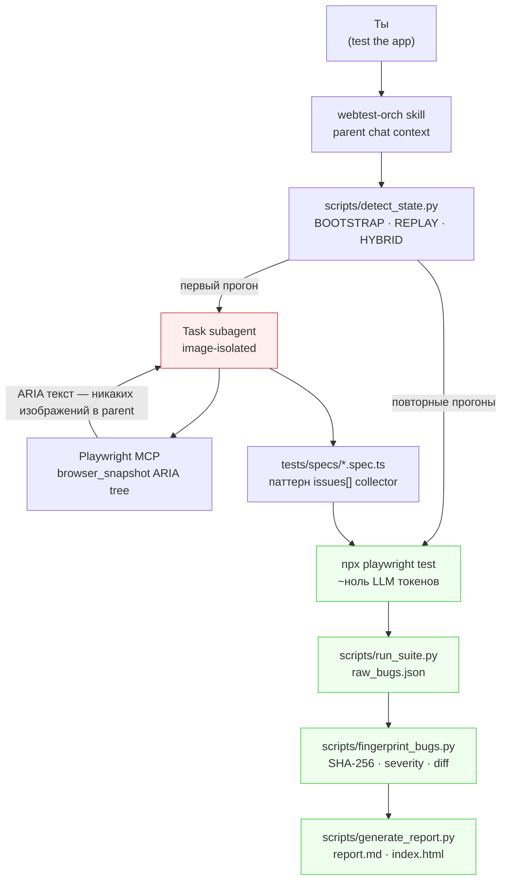

# webtest-orch

[](https://github.com/CreatmanCEO/webtest-orch/actions/workflows/ci.yml)
[](LICENSE)
[](https://www.npmjs.com/package/webtest-orch)
[](https://www.python.org/downloads/)
[](https://nodejs.org)
[](https://code.claude.com)

🇷🇺 Русский · [🇬🇧 English](README.md)

**Skill для Claude Code, который автоматизирует e2e-тестирование любого веб-приложения и при этом не сжигает невидимый лимит inline-изображений Claude — `/compact` не вылетает на 51-м скриншоте.**

> Первый прогон: LLM-driven exploration через Playwright MCP, ARIA-tree first, генерирует `*.spec.ts`. Последующие прогоны: детерминированный `npx playwright test`, ~ноль LLM-токенов. Bug fingerprinting различает прогоны (`new` / `regression` / `persisting` / `fixed`). Маппинги в Linear / GitHub / Jira из коробки.

---

## Зачем это нужно

В Claude Code **два независимых лимита контекста**: текстовые токены (большой) и inline-image blocks (~50–100 за сессию). Image-budget — невидимый: счётчика нет, ты просто упираешься в стену и должен делать `/compact` даже когда текстовый контекст заполнен на 20%. Обычное использование Playwright MCP пожирает его за час, потому что каждый screenshot, возвращённый в parent, — это один image-budget block.

**Этот skill делает стоимость image-budget нулевой.** Все browser-операции выполняются внутри Task subagent'ов; parent чат получает только текст — пути, описания, verdict'ы. Pixel-diff регрессия возвращает `pass/fail + diff%` как обычный текст. Vision-классификация одного провалившегося скриншота делегируется в nested subagent, который читает изображение в своём изолированном контексте и возвращает одну строку.

Вторая половина skill'а — orchestration layer над стеком LLM-driven testing 2026 года: Playwright MCP для exploration, Playwright CLI для replay, axe-core для детерминированных 57% WCAG, плюс детерминистический классификатор console-noise, чтобы LLM звался только на сообщения, которых нет в pattern-таблице.

> Валидирован end-to-end на двух production приложениях: статический Next.js портфолио (4 реальных бага найдено, 0 ложных срабатываний) и Supabase + FastAPI + WebSocket SaaS-чат (10/10 сгенерированных spec'ов прошли зелёным после 4 итераций, ~12 минут wall-clock).

---

## Как это работает — три фазы, один image-budget invariant



| Фаза | Что происходит | Стоимость в image budget |
|---|---|---|
| **State probe** | `detect_state.py` читает `tests/`, `playwright.config.ts`, `.env.test`, listening ports → JSON → mode hint (BOOTSTRAP / REPLAY / HYBRID) | 0 |
| **BOOTSTRAP exploratory** (первый прогон) | Task subagent использует Playwright MCP `browser_snapshot` (ARIA tree, текст). Walk'ит login / chat / settings / logout. Генерирует POMs + `tests/specs/*.spec.ts`. | 0 в parent (subagent изолирован) |
| **REPLAY** (последующие прогоны) | `npx playwright test` напрямую. Console listeners, axe-core, `toHaveScreenshot` — всё в spec, возвращает текст. | 0 |
| **Vision classification** (только когда `toHaveScreenshot` срабатывает) | Nested Task subagent читает ОДИН image, возвращает строку `<verdict>: <reason>` | 0 в parent, 1 на subagent (макс 3-5/прогон) |
| **Fingerprint + diff** | Composite SHA-256 от `(selector \| assertion \| error class \| URL template \| message)`. Diff state: `new` / `regression` / `persisting` / `fixed`. | 0 |
| **Report** | `report.md` + self-contained `index.html` + `bugs.json` с маппингами в Linear / GitHub / Jira | 0 |

Image-budget invariant — non-negotiable. Любая ветка кода, которая возвращает скриншот inline в parent чат, — это баг.

---

## Что ты получаешь

```
~/.claude/skills/webtest-orch/
├── SKILL.md                            # workflow для Claude Code (~250 строк)
├── README.md, CHANGELOG.md, LICENSE    # документация
├── install.sh                          # bash-инсталлер (альтернатива npm)
├── bin/webtest-orch.js                 # CLI: install / status / uninstall
├── scripts/
│   ├── detect_state.py                 # JSON state probe + mode hint
│   ├── with_server.py                  # dev-server lifecycle (front + back)
│   ├── run_suite.py                    # обёртка над `playwright test`, нормализация JSON,
│   │                                   #  раскрытие issues[] collector в bug records per issue
│   ├── fingerprint_bugs.py             # SHA-256 fingerprints, severity heuristics,
│   │                                   #  маппинги Linear/GitHub/Jira, run diff
│   ├── triage_console.py               # default ignore-list для GTM/Stripe/Pydantic/
│   │                                   #  Next.js Turbopack/Supabase realtime/etc.
│   ├── visual_diff.py                  # находит провалившиеся toHaveScreenshot,
│   │                                   #  готовит задачи для vision-классификации
│   ├── vision_classify.py              # валидирует `<verdict>: <reason>` от subagent
│   ├── generate_report.py              # report.md + self-contained index.html + diff
│   ├── preflight.py                    # base-URL HEAD-check + auth env validation
│   └── _image_isolation_check.py       # self-test для budget invariant
├── reference/                          # загружается on-demand, не на активации
│   ├── playwright-patterns.md          # locator priority, anti-flake, tabs-vs-buttons
│   ├── auth-strategies.md              # Supabase · custom JWT · UI fallback · onboarding-флаги
│   ├── a11y-patterns.md                # axe + qualitative review через nested subagent
│   ├── responsive-checklist.md         # viewports, touch targets, overflow detection
│   ├── console-noise-patterns.md       # ignore-list patterns + bug-classifier table
│   ├── stack-specific.md               # Next.js · FastAPI · Telegram WebApp · WS/SSE · TTS
│   └── reporting.md                    # bugs.json schema · severity mapping · tracker integrations
├── templates/
│   ├── playwright.config.ts.tmpl       # с auth (setup project + storageState)
│   ├── playwright.config.public.ts.tmpl # вариант без auth
│   ├── auth.setup.ts.tmpl              # цепочка Supabase → custom JWT → UI fallback
│   ├── fixture.ts.tmpl, pom.ts.tmpl    # POM + fixture скелеты
│   └── spec.ts.tmpl                    # канонический паттерн issues[] collector
└── examples/
    ├── public-landing.spec.ts          # статический сайт (без auth)
    ├── authed-dashboard.spec.ts        # POM + storageState
    └── telegram-webapp.spec.ts         # mock window.Telegram.WebApp
```

---

## Quick Start (3 минуты)

### 1. Установить skill

```bash
npx webtest-orch@beta install
```

Скопирует skill в `~/.claude/skills/webtest-orch/` и проверит наличие нужных MCP-серверов.

### 2. Добавить MCP-серверы (если установщик скажет что отсутствуют)

```bash
claude mcp add --scope user playwright npx @playwright/mcp@latest
claude mcp add --scope user chrome-devtools npx chrome-devtools-mcp@latest
```

### 3. Перезапустить Claude Code

Skills загружаются при старте сессии.

### 4. Создать `.env.test` в проекте

Для authenticated SaaS (пример Supabase):

```bash
TEST_BASE_URL=https://your-app.example.com
TEST_USER_EMAIL=qa@example.com
TEST_USER_PASSWORD=...
SUPABASE_URL=https://abcdefgh.supabase.co
SUPABASE_ANON_KEY=eyJhbGc...
```

Для public сайта:

```bash
TEST_BASE_URL=https://your-public-site.example.com
```

### 5. В Claude Code

Скажи:

> протестируй приложение

или `test the app`, или slash-команда `/test-app`. Skill сам определит authed vs public, scaffold'нет Playwright + axe-core, сделает первый exploratory pass, и запишет `reports/<run-id>/index.html` который можно открыть в браузере.

Полный список triggering keywords (`smoke test`, `regression run`, `audit accessibility`, и т.д.) — в [SKILL.md](SKILL.md).

---

## Что тестируется из коробки

Каждый сгенерированный spec работает по паттерну **issues[] collector** — все soft-проверки накапливаются, тест падает один раз в конце с полной картиной, не останавливаясь на первом промахе:

- **Console errors** — listeners attached BEFORE `page.goto()`. Default ignore-list покрывает GTM, Stripe deprecations, Sentry self-warnings, Pydantic FastAPI warnings, Next.js 15 Turbopack signals, Supabase realtime debug, ResizeObserver loop, AbortError на unmount, browser-extension шум, и ещё 9 паттернов. Hydration mismatches, uncaught TypeErrors, CORS / CSP violations, 5xx / 4xx ответы попадают в баги с severity.
- **WCAG 2.2 AA через axe-core** — каждый spec прогоняет `AxeBuilder` и пушит каждый violation как `a11y[impact] rule-id: help (Nx nodes)` в `issues[]`. Severity выводится из axe impact level.
- **Heading hierarchy** — никаких прыжков `h1 → h3`. Ловит распространённый Tailwind/headlessui-паттерн со списками проектов.
- **Touch targets (WCAG 2.5.8)** — каждый интерактивный элемент ≥ 24×24 CSS px. Mobile project (`chromium-mobile`, 390×844) ловит то что desktop пропускает.
- **Horizontal overflow** — `scrollWidth > clientWidth` per viewport.
- **`html lang` attribute** — присутствует.

Visual regression использует встроенный `toHaveScreenshot()` (zero внешних зависимостей). Когда pixel-diff срабатывает, `visual_diff.py` ставит задачу для vision-классификации, и Task subagent (одно изображение, возвращает текст) маркирует её `noise` / `redesign` / `bug-S0..3`.

---

## Severity model

| Severity | Когда skill присваивает |
|---|---|
| **S0 Critical** | Auth сломан, payment не работает, 5xx на main routes, uncaught JS errors, hydration mismatch на критическом flow |
| **S1 Major** | Form non-functional, primary nav сломана, CORS / CSP violation, axe `serious` / `critical`, horizontal overflow |
| **S2 Moderate** | Validation message неверный, secondary feature degraded, axe `moderate`, heading jump, touch-target < 24×24, html-lang missing |
| **S3 Minor** | Visual / pixel diff, alignment shifts, axe `minor`, title check failure |

Override эвристики per-spec через **три механизма** (приоритет сверху вниз):

1. Inline-tag в collector: `issues.push('[severity:S0] payment completely broken')`
2. Inline-tag в test name: `test('[severity:S0] checkout fails', ...)`
3. Comment перед тестом: `// @severity: S0\n  test('...', ...)` → парсит `fingerprint_bugs.py`

Это решает кейс false-negative когда P0 product-регрессия получает S2 по эвристике и отчёт говорит ✅ SHIP-READY.

---

## CLI команды

```bash
npx webtest-orch help              # все команды
npx webtest-orch status            # установлен ли skill? есть ли MCPs?
npx webtest-orch install           # copy mode (default; production-safe)
npx webtest-orch install --symlink # symlink mode (для разработки; на Windows нужен Developer Mode)
npx webtest-orch uninstall         # удалит skill, npm-пакет не трогает
npx webtest-orch version
```

---

## Документация

- **[SKILL.md](SKILL.md)** — workflow которому Claude следует при активации, плюс canonical spec generation contract.
- **[CHANGELOG.md](CHANGELOG.md)** — версионируется per release; текущая beta `0.3.0`.
- **[reference/auth-strategies.md](reference/auth-strategies.md)** — Supabase / custom JWT / UI fallback / onboarding-флаги.
- **[reference/stack-specific.md](reference/stack-specific.md)** — Next.js, FastAPI, Telegram WebApp, WebSocket DOM-fallback стратегия, TTS canvas паттерны.
- **[reference/reporting.md](reference/reporting.md)** — bugs.json schema, severity mapping, Linear / GitHub / Jira CLI примеры.
- **[CONTRIBUTING.md](CONTRIBUTING.md)** — PR workflow.

---

## Статус — public beta

**`0.3.0-beta`** — image-budget protection, Supabase auth, severity annotations, full CI на Linux/macOS/Windows, 113 тестов. Валидирован end-to-end на двух production приложениях. Ищем early users чтобы найти rough edges — см. [issue template для OS-compatibility report](.github/ISSUE_TEMPLATE/os-compatibility-report.md) если запускал установку на не-Windows ОС.

Что дальше:
- `0.4.0` — vision-classifier auto-loop, console LLM auto-triage, Lighthouse audit script, tracker auto-filing CLI, regression watchlist, layout integrity assertions.

---

## Лицензия

MIT — см. [LICENSE](LICENSE).

## Contributing

PR'ы приветствуются — см. [CONTRIBUTING.md](CONTRIBUTING.md). Для OS-specific bug reports используй [issue template](.github/ISSUE_TEMPLATE/os-compatibility-report.md).
