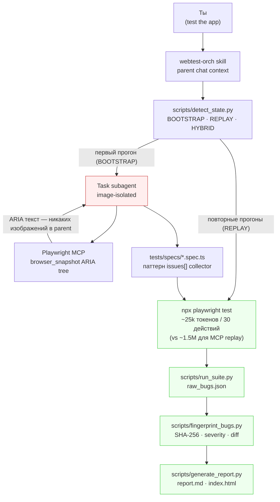

# webtest-orch

[](https://github.com/CreatmanCEO/webtest-orch/actions/workflows/ci.yml)
[](LICENSE)
[](https://www.npmjs.com/package/webtest-orch)
[](https://www.python.org/downloads/)
[](https://nodejs.org)
[](https://code.claude.com)

🇷🇺 Русский · [🇬🇧 English](README.md)

**Token-efficient e2e orchestration skill для Claude Code. Один раз исследуем приложение через Playwright MCP — ARIA snapshots, не изображения. Дальше прогоняем детерминированно через `npx playwright test` — ~ноль LLM-токенов. Bug fingerprinting + run-diff (`new` / `regression` / `persisting` / `fixed`) из коробки. Тесты живут в твоём репо как обычные `*.spec.ts`. MIT.**

> **Зачем это нужно — одна цифра:** Playwright MCP сжигает ~**1.5M токенов** на verify e-commerce checkout. Playwright **CLI** делает то же в ~**25–27k** ([Özal benchmark](https://github.com/microsoft/playwright-mcp/issues/889), [TestDino](https://testdino.com/blog/playwright-cli/), [Morph](https://scrolltest.medium.com/playwright-mcp-burns-114k-tokens-per-test-the-new-cli-uses-27k-heres-when-to-use-each-65dabeaac7a0)). Фикс — не «использовать меньше Playwright MCP», а **разделить exploration** (LLM-driven, генерирует spec.ts) **и replay** (детерминированный, прогоняется бесконечно). webtest-orch — orchestration layer, который делает оба.

---

## Где это место на карте

Рынок AI-тестирования 2026 года расщеплён на два диапазона:

| Диапазон | Примеры | Цена | За что платишь |
|---|---|---|---|
| **Платный SaaS** | [Octomind](https://octomind.dev) ($89–$589/мес, [сейчас сворачивается](https://octomind.dev/blog/a-letter-to-our-users-customers-and-readers/)), [QA Wolf](https://www.qawolf.com) (~$8k/мес entry, $60–250k/год typical), [Mabl](https://mabl.com), [BrowserStack AI](https://www.browserstack.com/low-code-automation/ai-agents) | Cloud parallelism, human triage layer, SOC 2, SLA, дашборды | $1k–$25k/мес реальный расход |
| **Free / OSS** | [`playwright init-agents --loop=claude`](https://playwright.dev/docs/test-agents), [Magnitude](https://github.com/magnitudedev/magnitude), **webtest-orch** | Skill / SDK / CLI, который запускаешь сам; тесты живут в твоём репо | $0/мес — но без managed cloud, без human review, без SOC 2 |

**Честный peer group у webtest-orch — free tier.** Защитимые отличия от Microsoft's native Test Agents и Magnitude: встроенный `axe-core` для a11y, console + network audit, **bug fingerprinting с run-diff**, и Linear / GitHub / Jira tracker mappings — ничего из этого free-альтернативы не делают.

**Для solo-девов, indie-хакеров и стартапов 1–10 инженеров уже на Claude Code, у которых нет QA-бюджета**, webtest-orch — реальная замена платным AI testing tools при $0 budget. Для команд с бюджетом на cloud parallelism + human review at scale — нет, и мы не претендуем.

---

## Что мы намеренно НЕ делаем

- **Никакого self-healing.** В 2026 QA-сообщество [пушит обратно self-healing как маркетинговый spin](https://bugbug.io/blog/test-automation/self-healing-test-automation/) — failure mode хорошо задокументирован: healer выбирает visually-similar-но-неправильный элемент, тест зеленеет, баг шипится. Инженеры перестают доверять suite'ам которые *врут*. Мы предпочитаем красное поверх ложно-зелёного. *Если хочешь native Playwright Healer — он бесплатный через `npx playwright init-agents --loop=claude`, и наши сгенерированные спеки совместимы — рекомендуемая skip-real-bugs policy в [reference/playwright-patterns.md](reference/playwright-patterns.md).*
- **Никакого vendor cloud.** Тесты остаются в твоём репо. Отчёты — в твоей файловой системе. Если наш npm-пакет завтра исчезнет — твой suite продолжит работать.
- **Никаких pitch'ей «AI напишет все твои тесты».** webtest-orch — *дополнение*, а не замена инженерного suждения. Особенно хорош на скучных 80%: a11y, console, network, responsive, regression diffs.

---

## Как это работает — три фазы, один image-budget invariant



| Фаза | Что происходит | Стоимость в токенах |
|---|---|---|
| **State probe** | `detect_state.py` читает `tests/`, `playwright.config.ts`, `.env.test`, listening ports → JSON → mode hint (BOOTSTRAP / REPLAY / HYBRID) | 0 |
| **BOOTSTRAP exploratory** (первый прогон) | Task subagent использует Playwright MCP `browser_snapshot` (ARIA tree, текст). Walk'ит login / chat / settings / logout. Генерирует POMs + `tests/specs/*.spec.ts`. | ~500k токенов на полный exploration; image budget cost = 0 в parent |
| **REPLAY** (каждый последующий прогон) | `npx playwright test` напрямую. Console listeners, axe-core, `toHaveScreenshot()` — всё в spec, возвращает текст. | **~25–27k токенов / 30 действий** ([TestDino](https://testdino.com/blog/playwright-cli/) / [Morph](https://scrolltest.medium.com/playwright-mcp-burns-114k-tokens-per-test-the-new-cli-uses-27k-heres-when-to-use-each-65dabeaac7a0)) — в **50–60× дешевле** Playwright MCP replay |
| **Vision classification** (только когда `toHaveScreenshot` срабатывает) | Nested Task subagent читает ОДИН image, возвращает строку `<verdict>: <reason>` | 0 в parent, 1 image на subagent (max 3-5 / прогон) |
| **Fingerprint + diff** | Composite SHA-256 от `(selector \| assertion \| error class \| URL template \| message)`. Diff state: `new` / `regression` / `persisting` / `fixed` | 0 |
| **Report** | `report.md` + self-contained `index.html` + `bugs.json` с маппингами в Linear / GitHub / Jira | 0 |

Image-budget invariant — архитектурный якорь: **parent чат никогда не получает изображение, никогда**. Все browser-операции выполняются внутри Task subagent'ов; parent получает только текст. Эмпирически проверено — subagent читает N PNG, возвращает N текстовых строк, image-counter родителя не растёт.

---

## Построено на реальных бенчмарках

Это не vibe-coded testing skill. Архитектура построена на верифицированных цифрах 2026 года:

| Утверждение | Источник | Implication |
|---|---|---|
| Playwright MCP: ~**1.5M** токенов / e-commerce verify | [Özal benchmark](https://github.com/microsoft/playwright-mcp/issues/889) | Не использовать MCP для replay |
| Playwright CLI: ~**25–27k** токенов / 30 действий | [TestDino](https://testdino.com/blog/playwright-cli/), [Morph](https://scrolltest.medium.com/playwright-mcp-burns-114k-tokens-per-test-the-new-cli-uses-27k-heres-when-to-use-each-65dabeaac7a0) | Использовать CLI для replay — в 50–60× дешевле |
| 4-агентный pipeline (Plan → Generate → Run → Heal): **~4×** меньше токенов vs live-MCP | [TestDino blog](https://testdino.com/blog) | Validates webtest-orch architecture |
| **a11y-tree primary + selective vision** обходит vision-first по cost AND reliability | Microsoft Fara-7B, [arXiv 2511.19477](https://arxiv.org/abs/2511.19477), Browserbase evals | ARIA `browser_snapshot` — корректный default, не скриншоты |
| **axe-core** auto-detects ~**57%** реальных WCAG issues | [Deque 13,000-page study](https://www.deque.com/) | Остальные 43% требуют LLM judgment — skill ships оба |
| Microsoft README рекомендует **CLI + Skills over MCP** для coding-агентов | [Microsoft Playwright official docs](https://playwright.dev/docs/test-agents) | Мы выровнены с архитектурной рекомендацией самого вендора |
| WCAG 2.5.8 AA touch-target = **24×24 CSS px** | [W3C](https://www.w3.org/WAI/WCAG22/Understanding/target-size-minimum.html) | Hard rule, mobile project enforces |
| ADA Title II compliance deadline: **24 апреля 2026** для гос-секторов (WCAG 2.1 AA) | [W3C / DOJ](https://www.ada.gov/resources/2024-03-08-web-rule/) | Legal context для a11y findings |

---

## Что ты получаешь

```
~/.claude/skills/webtest-orch/
├── SKILL.md                            # workflow для Claude Code (~250 строк)
├── README.md, CHANGELOG.md, LICENSE    # документация
├── install.sh                          # bash-инсталлер (альтернатива npm)
├── bin/webtest-orch.js                 # CLI: install / status / uninstall
├── scripts/
│   ├── detect_state.py                 # JSON state probe + mode hint
│   ├── with_server.py                  # dev-server lifecycle (front + back)
│   ├── run_suite.py                    # обёртка над `playwright test`, нормализация JSON,
│   │                                   #  раскрытие issues[] collector в bug records per issue
│   ├── fingerprint_bugs.py             # SHA-256 fingerprints, severity heuristics,
│   │                                   #  маппинги Linear/GitHub/Jira, run diff
│   ├── triage_console.py               # default ignore-list для GTM/Stripe/Pydantic/
│   │                                   #  Next.js Turbopack/Supabase realtime/etc.
│   ├── visual_diff.py                  # находит провалившиеся toHaveScreenshot,
│   │                                   #  готовит задачи для vision-классификации
│   ├── vision_classify.py              # валидирует `<verdict>: <reason>` от subagent
│   ├── generate_report.py              # report.md + self-contained index.html + diff
│   ├── preflight.py                    # base-URL HEAD-check + auth env validation
│   └── _image_isolation_check.py       # self-test для budget invariant
├── reference/                          # загружается on-demand
│   ├── playwright-patterns.md          # locator priority, anti-flake, tabs-vs-buttons,
│   │                                   #  rationale "никакого self-heal by design"
│   ├── auth-strategies.md              # Supabase · custom JWT · UI fallback · onboarding-флаги
│   ├── a11y-patterns.md, responsive-checklist.md
│   ├── console-noise-patterns.md, stack-specific.md, reporting.md
├── templates/
│   ├── playwright.config.ts.tmpl       # с auth (setup project + storageState)
│   ├── playwright.config.public.ts.tmpl # вариант без auth
│   ├── auth.setup.ts.tmpl              # цепочка Supabase → custom JWT → UI fallback
│   ├── fixture.ts.tmpl, pom.ts.tmpl    # POM + fixture скелеты
│   └── spec.ts.tmpl                    # канонический паттерн issues[] collector
└── examples/
    ├── public-landing.spec.ts          # статический сайт (без auth)
    ├── authed-dashboard.spec.ts        # POM + storageState
    └── telegram-webapp.spec.ts         # mock window.Telegram.WebApp
```

---

## Quick Start (3 минуты)

### 1. Установить skill

```bash
npx webtest-orch@beta install
```

### 2. Добавить MCP-серверы (если установщик скажет что отсутствуют)

```bash
claude mcp add --scope user playwright npx @playwright/mcp@latest
claude mcp add --scope user chrome-devtools npx chrome-devtools-mcp@latest
```

### 3. Перезапустить Claude Code

Skills загружаются при старте сессии.

### 4. Создать `.env.test` в проекте

```bash
# Authenticated SaaS (пример Supabase)
TEST_BASE_URL=https://your-app.example.com
TEST_USER_EMAIL=qa@example.com
TEST_USER_PASSWORD=...
SUPABASE_URL=https://abcdefgh.supabase.co
SUPABASE_ANON_KEY=eyJhbGc...

# Public сайт
TEST_BASE_URL=https://your-public-site.example.com
```

### 5. В Claude Code

Скажи: «протестируй приложение» / `test the app` / `/test-app`. Skill сам определит authed vs public, scaffold'ит Playwright + axe-core, прогонит первый exploratory pass, запишет `reports/<run-id>/index.html`.

---

## Что тестируется из коробки

Каждый сгенерированный spec работает по паттерну **issues[] collector** — soft-проверки накапливаются, тест падает один раз в конце с полной картиной:

- **Console errors** — listeners attached BEFORE `page.goto()`. Default ignore-list: GTM, Stripe deprecations, Sentry self-warnings, Pydantic FastAPI warnings, Next.js 15 Turbopack signals, Supabase realtime, ResizeObserver loop, AbortError, browser-extension. Hydration mismatches, uncaught TypeErrors, CORS / CSP, 5xx / 4xx ответы → bug records.
- **WCAG 2.2 AA через axe-core** — `AxeBuilder.withTags(['wcag2a','wcag2aa','wcag21aa','wcag22aa']).analyze()`. Каждый violation в `issues[]` как `a11y[impact] rule-id: help (Nx nodes)`. Severity из axe `impact` (critical/serious → S1, moderate → S2, minor → S3).
- **Heading hierarchy** — никаких прыжков `h1 → h3`.
- **Touch targets (WCAG 2.5.8 AA)** — каждый интерактивный элемент ≥ 24×24 CSS px на mobile-viewport.
- **Horizontal overflow** — `scrollWidth > clientWidth` per viewport.
- **`html lang`** атрибут присутствует.

Visual regression — встроенный `toHaveScreenshot()` (ноль внешних зависимостей). Когда pixel-diff срабатывает, `visual_diff.py` ставит задачу для vision-классификации, и Task-subagent маркирует image как `noise` / `redesign` / `bug-S0..3`.

---

## Severity model + механизмы override

Дефолтная эвристика обычно работает, но может выдать false-negative — P0 регрессия со severity S2. **Три механизма override** (приоритет):

```ts
// 1. Inline-tag в collector
issues.push('[severity:S0] payment completely broken');

// 2. Inline-tag в имени теста
test('[severity:S0] checkout fails', ...);

// 3. Comment непосредственно перед test() — парсит fingerprint_bugs.py
// @severity: S0
test('checkout fails', ...);
```

| Severity | Когда skill присваивает |
|---|---|
| **S0 Critical** | Auth сломан, payment не работает, 5xx на main routes, uncaught JS errors, hydration mismatch на критическом flow |
| **S1 Major** | Form non-functional, primary nav сломана, CORS / CSP violation, axe `serious` / `critical`, horizontal overflow |
| **S2 Moderate** | Validation message неверный, axe `moderate`, heading jump, touch-target < 24×24, html-lang missing |
| **S3 Minor** | Visual / pixel diff, alignment shifts, axe `minor`, title check failure |

---

## CLI команды

```bash
npx webtest-orch help              # все команды
npx webtest-orch status            # установлен ли skill? есть ли MCPs?
npx webtest-orch install           # copy mode (default)
npx webtest-orch install --symlink # symlink mode (для разработки; на Windows нужен Developer Mode)
npx webtest-orch uninstall         # удалит skill, npm-пакет не трогает
npx webtest-orch version
```

---

## Документация

- **[SKILL.md](SKILL.md)** — workflow которому Claude следует при активации.
- **[CHANGELOG.md](CHANGELOG.md)** — текущая beta `0.3.x`.
- **[reference/auth-strategies.md](reference/auth-strategies.md)** — Supabase / custom JWT / UI fallback / onboarding-флаги.
- **[reference/stack-specific.md](reference/stack-specific.md)** — Next.js, FastAPI, Telegram WebApp, WebSocket DOM-fallback стратегия, TTS canvas паттерны.
- **[reference/reporting.md](reference/reporting.md)** — bugs.json schema, severity mapping, Linear / GitHub / Jira CLI примеры.
- **[reference/playwright-patterns.md](reference/playwright-patterns.md)** — locator priority, anti-flake, "никакого self-heal by design" rationale.

---

## Валидирован на реальных production-приложениях

Оба target-приложения public на GitHub — можно сходить и посмотреть. Это не синтетические бенчмарки:

- **[Персональное портфолио](https://github.com/CreatmanCEO/portfolio)** ([creatman.site](https://creatman.site)) — static Next.js, mobile viewport. Skill нашёл 4 реальных бага, **0 false positives**: 1× S1 axe color-contrast (8 элементов), 2× S2 touch-target < 24×24, 1× S2 heading-jump h1→h3. Total tokens: <500k. Image budget сожжённый в parent: **0**.
- **[Lingua Companion](https://github.com/CreatmanCEO/lingua-companion)** ([lingua.creatman.site](https://lingua.creatman.site)) — voice-first AI language-learning SaaS, Next.js 16 + FastAPI + Supabase + WebSocket + Deepgram + Groq + ElevenLabs. 11 спеков на login / chat / translation / TTS / settings / phrase library / scenario / stats / end-session / logout. **10/10 сгенерированных спеков прошли зелёным** после 4 итераций. Wall-clock first-run: ~12 минут.

Lingua-dogfood выдал 6 feedback-айтемов, ставших `0.2.0` фиксами — Supabase auth pattern, onboarding-overlay state-seeding, severity annotations, spec generation contract enforcement, doc-drift fix, locator-quality guidance. Догфудим собственную работу на собственных OSS-приложениях.

---

## Статус — public beta

**`0.3.x-beta`** — image-budget protection, Supabase auth, severity annotations, full CI на Linux/macOS/Windows, 113 тестов. Валидирован end-to-end на двух production-приложениях.

**Ищем early users на Linux/macOS** — Windows хорошо тестирован, но мой CI matrix для install path охватывает только Linux. 5-минутный [issue template для OS-compatibility report](https://github.com/CreatmanCEO/webtest-orch/issues/new?template=os-compatibility-report.md).

Что дальше (`0.4`):
- Vision-classifier auto-loop, console LLM auto-triage, Lighthouse audit script
- Tracker auto-filing CLI (`file_bugs.py --linear / --github / --jira`)
- Regression watchlist + layout integrity assertions

---

## Связанные работы и credible voices

Если ты исследуешь AI-driven web-тестирование в 2026 — это canonical references:

- **[Simon Willison's Claude Code + Playwright MCP TIL](https://til.simonwillison.net/claude-code/playwright-mcp-claude-code)** — де-факто справочник по интеграции; мы следуем его правилу «say `Playwright:` explicitly or Claude shells out to bash» по всему скиллу.
- **[Matt Pocock's `skills` repo](https://github.com/mattpocock/skills)** (45k+ stars) — задаёт фрейм «skills as engineering primitives». Есть TDD + diagnose, нет e2e — gap который заполняет webtest-orch.
- **[Alexander Opalic's "Building an AI QA Engineer"](https://alexop.dev/posts/building_ai_qa_engineer_claude_code_playwright/)** — самый цитируемый туториал в нише. Personality framing («Quinn»), humble skepticism, голос «complement not replacement» — та же философия что у webtest-orch.
- **[Pramod Dutta's token-cost analysis](https://scrolltest.medium.com/playwright-mcp-burns-114k-tokens-per-test-the-new-cli-uses-27k-heres-when-to-use-each-65dabeaac7a0)** — вирусная статья сделавшая trade-off MCP-vs-CLI legible. Архитектура webtest-orch построена на этом insight.
- **[Microsoft `playwright init-agents`](https://playwright.dev/docs/test-agents)** — официальный triplet Planner / Generator / Healer. webtest-orch совместим; добавляем audit + run-diff layer сверху.

---

## Лицензия

MIT — см. [LICENSE](LICENSE).

## Contributing

PR'ы приветствуются — см. [CONTRIBUTING.md](CONTRIBUTING.md). Для OS-specific bug reports используй [issue template](.github/ISSUE_TEMPLATE/os-compatibility-report.md).
